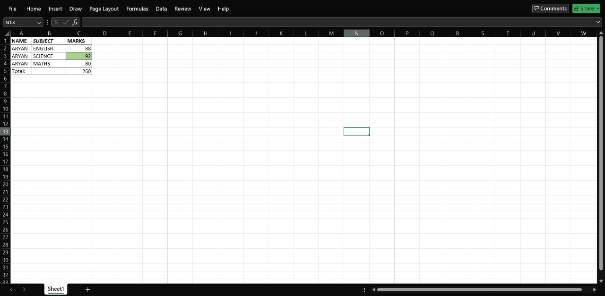

# 📊 Aryan's Data Analyst Portfolio

## ✅ Day 1 – Excel Basics

📁 File: 
🛠️ Skills: Excel Formatting, Data Entry, SUM Formula
📝 Description: Created a student marksheet...
📅 Date: 01 July 2025
### Skills Used:
- Excel formatting (Bold, Borders, Fill Color)
- SUM formula
- Screenshot documentation

### Tools:
- Microsoft Excel (Mobile)
- GitHub

---

## ✅ Day 2 – Excel Formula Mastery

📁 File: `Excelpractice2.png`  
🛠️ Skills Used: SUM, AVERAGE, MIN, MAX, COUNT  
📝 Description:  
Created a student marks table and used formulas to calculate:
- Total Marks
- Average Marks
- Highest & Lowest Scores
- Subject Count  
Formatted the sheet using bold headings, borders, and color highlights.

📅 Date: 2nd July 2025
📸 Screenshot:  

