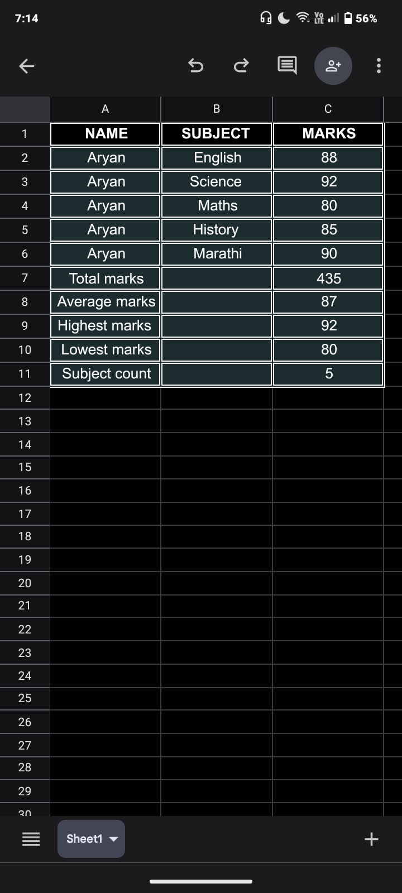
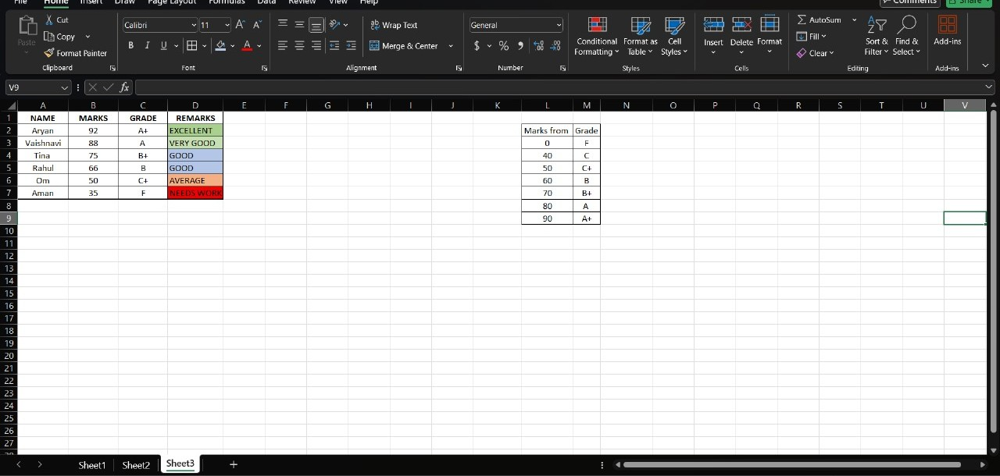
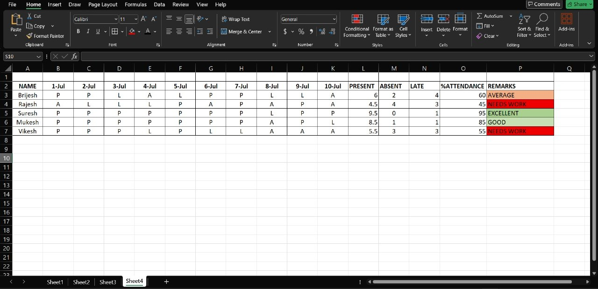

# 📊 Aryan's Data Analyst Portfolio

## ✅ Day 1 – Excel Basics

📁 File: 
🛠️ Skills: Excel Formatting, Data Entry, SUM Formula
📝 Description: Created a student marksheet...
📅 Date: 01 July 2025
### Skills Used:
- Excel formatting (Bold, Borders, Fill Color)
- SUM formula
- Screenshot documentation

### Tools:
- Microsoft Excel (Mobile)
- GitHub

---

## ✅ Day 2 – Excel Formula Mastery

📁 File:  
🛠️ **Skills Used:**
- Microsoft Excel
- Data Entry
- SUM, AVERAGE, MIN, MAX, COUNT formulas
- Table Formatting (bold headers, borders, colors)
📝 Description:  
Created a student marks table and used formulas to calculate:
- Total Marks
- Average Marks
- Highest & Lowest Scores
- Subject Count  
Formatted the sheet using bold headings, borders, and color highlights.

📁 File: 
🛠️ **Skills Used:**
- Microsoft Excel
- IF formula logic
- Conditional formatting
- Table formatting

📝 Description:  
Created a result sheet for 15 students using `IF` formula to auto-detect Pass/Fail status.  
- Marks ≥ 40 → "Pass"  
- Marks < 40 → "Fail"  
Used conditional formatting to show Pass (Green) and Fail (Red).

📅 Date: 2nd July 2025

---

## ✅ Day 3 – Auto Grade + Remarks Using VLOOKUP & IF

📁 File: 

🛠️ **Skills Used:**
- Excel VLOOKUP
- Nested IF formula
- Logic building
- Conditional formatting
- Table design

📝 Description:  
Created a result sheet with:
- VLOOKUP for Grade (based on marks)
- IF formula for Remarks (based on grade)

📅 Date: 3rd July 2025

---

## ✅ Day 4 – Advanced Attendance Tracker (10 Days)

📁 File: 
🛠️ **Skills Used:**
- COUNTIF logic (P, A, L)
- IF for remarks generation
- % calculation
- Conditional formatting

📝 Description:  
Built a 10-day attendance tracker with "Late" logic (0.5), auto-calculated present/absent/late days.  
Used IF formula to assign performance-based remarks.  
Formatted attendance % column with color codes.

📅 Date: 4th July 2025

